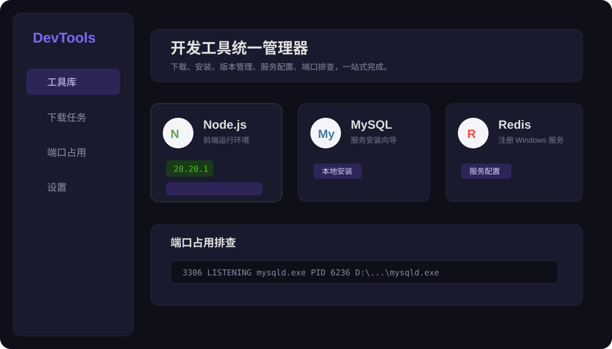

# DevTools 开发工具统一管理器

一个基于 Electron + Vue 3 + Vite 的桌面端开发工具管理器，用来统一下载、安装、检测和配置常用开发环境工具。



## 功能特性

- 工具库管理：JDK、Maven、Python、Node.js、MySQL、Redis、Git、VS Code、Claude Code、OpenAI Codex CLI。
- 分类浏览：后端、前端、数据库、AI 工具、其他。
- 多版本选择：支持 Node.js、JDK、Python、Maven、MySQL 等动态版本列表。
- 下载源配置：支持华为云、阿里云、腾讯云、官方源，以及 GitHub 镜像加速前缀。
- 下载缓存复用：缓存目录已有安装包时自动跳过重复下载。
- 本地安装向导：MySQL、Redis 支持从本地 zip 安装并生成配置文件预览。
- Windows 服务注册：MySQL 和 Redis 可注册到 `services.msc`，支持开机自启动。
- 端口占用排查：查看端口、PID、进程名和可执行文件路径，支持快速搜索。
- 自动检测已安装工具：从系统 PATH 中识别已有安装。

## 界面说明

### 工具库

工具库用于查看工具状态、选择版本、下载安装或升级。工具卡片会显示安装版本、安装路径和下载源预览。

### 下载任务

下载任务页展示下载进度、下载地址、缓存文件路径和安装日志。MySQL、Redis 的服务安装过程会实时输出到这里。

### 端口占用

端口占用页支持输入端口、进程名、PID 或路径快速定位占用进程，适合安装数据库服务前排查端口冲突。

### 设置

设置页可配置安装根目录、下载缓存目录、首选镜像源、GitHub 镜像下载前缀、探测超时和并发下载数。

默认 GitHub 镜像前缀：

```text
https://cdn.akaere.online
```

示例加速链接：

```text
https://cdn.akaere.online/github.com/redis-windows/redis-windows/releases/download/8.8.0/Redis-8.8.0-Windows-x64-msys2-with-Service.zip
```

## 快速开始

### 环境要求

- Windows 10/11
- Node.js 18 或更高版本
- npm

### 安装依赖

```powershell
npm install
```

### 开发运行

```powershell
npm run dev
```

项目已在开发脚本中加入 Electron GPU 兼容参数，适合部分远程桌面或虚拟显卡环境：

```text
--disable-gpu --disable-gpu-sandbox --disable-software-rasterizer
```

### 构建

```powershell
npm run build
```

### 打包

```powershell
npm run package
```

## MySQL 安装流程

MySQL 支持缓存包本地安装。安装向导包含四步：

1. 选择解压目录。
2. 配置服务名、IP、端口和 root 密码。
3. 预览并编辑 `my.ini`。
4. 确认后解压、初始化数据目录、注册 Windows 服务并启动。

默认配置：

```text
服务名：MySQL
IP：127.0.0.1
端口：3306
密码：123456
```

生成的 `my.ini` 会包含：

```ini
default-time-zone='+08:00'
max_allowed_packet=999M
sql-mode=STRICT_TRANS_TABLES,NO_ENGINE_SUBSTITUTION
```

## Redis 安装流程

Redis 使用 Windows with-Service 版本：

```text
Redis-8.8.0-Windows-x64-msys2-with-Service.zip
```

安装向导包含四步：

1. 选择解压目录。
2. 配置服务名、IP、端口和访问密码。
3. 预览并编辑 `redis.conf`。
4. 确认后解压、写入配置、使用 `RedisService.exe` 注册 Windows 服务并启动。

默认配置：

```text
服务名：Redis
IP：127.0.0.1
端口：6379
密码：123456
```

服务注册会使用用户选择的安装目录，不写死路径。

## 项目结构

```text
dev-tool-manage
├─ src
│  ├─ main              # Electron 主进程、IPC、下载、安装、端口检测
│  ├─ preload           # preload API 暴露
│  ├─ renderer          # Vue 前端页面和组件
│  └─ shared            # 工具配置与共享类型
├─ db                   # 本地任务和工具目录缓存
├─ docs
│  └─ images            # README 图片资源
├─ electron.vite.config.ts
├─ electron-builder.yml
└─ package.json
```

## 常用命令

```powershell
npm run dev      # 开发模式
npm run build    # 构建
npm run preview  # 预览构建结果
npm run package  # 打包桌面应用
```

## 技术栈

- Electron
- electron-vite
- Vue 3
- TypeScript
- Pinia
- Naive UI
- SQLite

## 注意事项

- 注册 Windows 服务通常需要管理员权限。
- 如果端口被占用，MySQL/Redis 安装向导会阻止继续安装，并显示占用进程。
- 下载缓存目录中已有安装包时，工具卡片会显示“本地安装”。
- GitHub 下载地址会在真实下载前自动拼接设置中的 GitHub 镜像前缀。

## License

MIT
